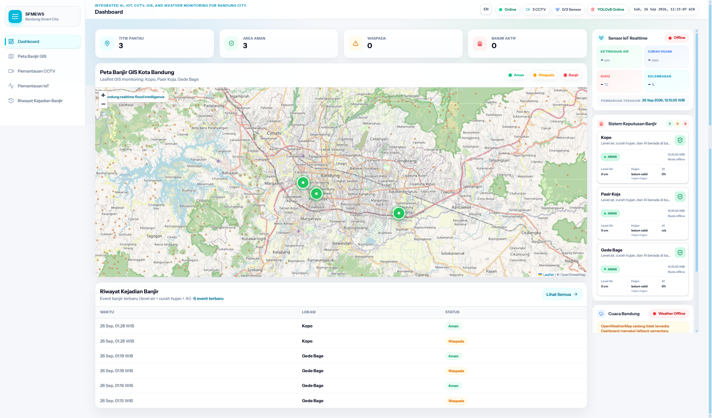
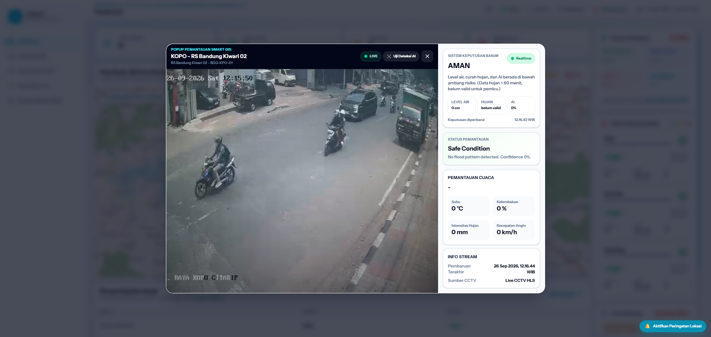
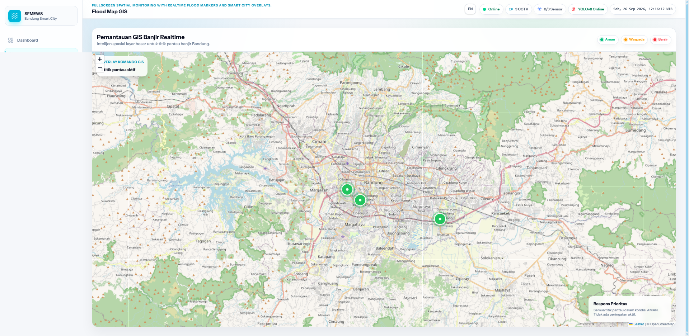
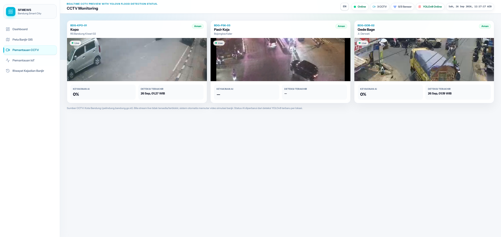
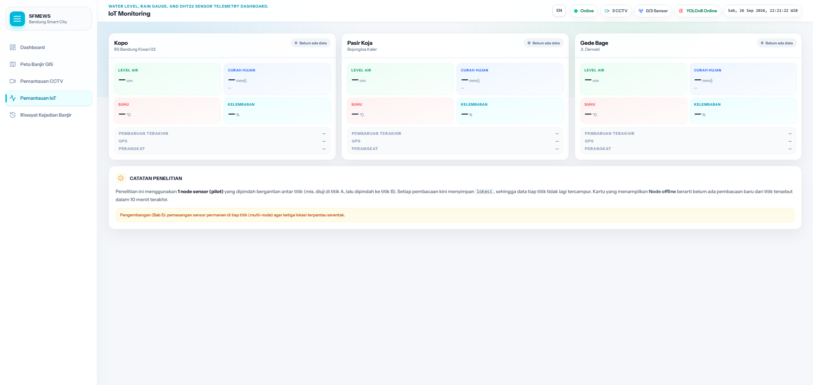
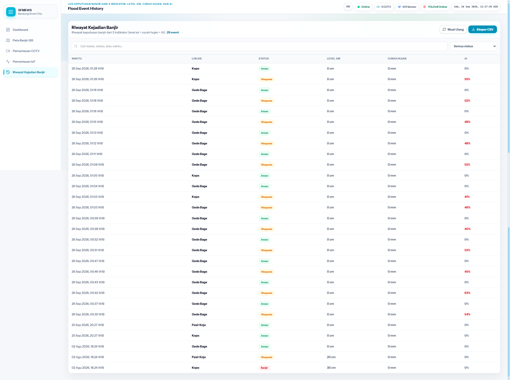

# 🌊 SFMEWS — Smart Flood Monitoring and Early Warning System

Sistem pemantauan dan peringatan dini banjir berbasis IoT untuk tiga titik rawan di Kota
Bandung. Menggabungkan **sensor lapangan**, **deteksi visual CCTV**, dan **data curah hujan**
menjadi satu keputusan status yang dapat dipertanggungjawabkan.


> Dibangun sebagai penelitian skripsi S1. Seluruh angka pada dokumen ini berasal dari
> pengujian yang benar-benar dijalankan, bukan perkiraan.

---

## 📸 Tampilan

**Dasbor utama** — ringkasan status ketiga titik, peta, panel keputusan, dan riwayat
terbaru dalam satu layar.



**Popup pemantauan titik** — siaran CCTV langsung, hasil deteksi visual, dan alasan
keputusan ditampilkan berdampingan. Terlihat kalimat alasan lengkap beserta penanda bahwa
data hujan belum sah untuk dipakai sebagai pemicu.



<table>
<tr>
<td width="50%"><b>Peta Web GIS</b><br><sub>Penanda berwarna menurut status tiap titik</sub><br><br></td>
<td width="50%"><b>Pemantauan CCTV</b><br><sub>Siaran ATCS dengan pemeriksaan YOLOv8</sub><br><br></td>
</tr>
<tr>
<td width="50%"><b>Pemantauan IoT</b><br><sub>Bacaan sensor per titik. Pada tangkapan ini node lapangan tidak terhubung, sehingga kartu menampilkan keadaan menunggu data</sub><br><br></td>
<td width="50%"><b>Riwayat Kejadian Banjir</b><br><sub>Hanya perubahan status yang dicatat, bukan setiap kali status dihitung</sub><br><br></td>
</tr>
</table>

---

## Masalah yang diselesaikan

Peringatan banjir yang hanya mengandalkan **satu** sumber data mudah keliru:

- **Sensor ketinggian air saja** — akurat, tetapi baru berbunyi ketika air sudah naik
- **Kamera saja** — dapat melihat lebih awal, tetapi kamera tunggal **tidak dapat mengukur
  kedalaman**. Aspal basah pada malam hari terlihat sangat mirip genangan
- **Curah hujan saja** — hujan lebat belum tentu menghasilkan genangan

SFMEWS menggabungkan ketiganya dengan aturan yang tegas soal **indikator mana yang boleh
memutuskan apa**, lalu melapisinya dengan mekanisme penstabil supaya status tidak
berkedip-kedip.

---

## Cara sistem memutuskan status

Tiga indikator, masing-masing dengan wewenang berbeda:

| Indikator | Peran | Wewenang |
|---|---|---|
| **Ketinggian air** | pengukuran | Satu-satunya yang boleh menyatakan **Banjir sendirian** (≥ 30 cm, Permen PU No. 1/PRT/M/2014) |
| **Deteksi visual CCTV** | bukti | Menaikkan **paling banyak satu tingkat**: Aman → Waspada, Waspada → Banjir |
| **Curah hujan** | indikator risiko | Hanya menaikkan Aman → Waspada (≥ 10 mm/jam, klasifikasi WMO). **Tidak pernah** sampai Banjir |

Tabel keputusan lengkap:

| Ketinggian air | Hujan | AI | Hasil |
|---|---|---|---|
| < 10 cm | < 10 mm/jam | tidak | **Aman** |
| < 10 cm | < 10 mm/jam | ya | Waspada |
| < 10 cm | ≥ 10 mm/jam | — | Waspada |
| 10–29 cm | < 10 mm/jam | tidak | Waspada |
| 10–29 cm | — | **ya** | **Banjir** |
| 10–29 cm | ≥ 10 mm/jam | tidak | Waspada |
| **≥ 30 cm** | — | — | **Banjir** (mutlak) |

Begitu air mencapai 30 cm, indikator lain tidak lagi berpengaruh.

---

## Mekanisme keandalan

Bagian ini yang membedakan sistem nyata dari prototipe. Masing-masing lahir dari masalah
yang benar-benar terjadi saat pengambilan data:

| Penjaga | Aturan | Masalah yang dicegah |
|---|---|---|
| **Anti-lonjakan** | Nilai ≥ 30 cm sah hanya bila pembacaan sebelumnya juga ≥ 30 cm | Satu pembacaan menyimpang probe (0 → 40 → 0 cm) memicu alarm banjir palsu |
| **Kesegaran AI** | Hasil deteksi > 15 menit dianggap **tidak tersedia**, bukan "aman" | Siaran CCTV mati diam-diam, hasil lama tertinggal dan tetap dipercaya |
| **Keabsahan hujan** | Intensitas mm/jam belum dipakai sebelum jendela 60 menit terisi | Angka intensitas yang belum mewakili keadaan sebenarnya |
| **Penstabil** | Status **naik seketika**, tetapi **turun** hanya setelah 3 evaluasi berturut-turut | Status berkedip-kedip ketika air bergoyang di sekitar ambang |
| **Riwayat selektif** | Catatan ditulis hanya ketika status **efektif** berubah | Riwayat penuh ribuan baris berisi status yang sama |

---

## Arsitektur

```
   Browser
      │
      ├───────────► Nginx :80 ───► Laravel PHP-FPM ───┐
      │             (halaman web)                     │ (sisi server:
      │                                               │  login admin)
      ├───────────► FastAPI :8000 ◄───────────────────┘
      │             (data JSON)         │
      │                                 │
      └───────────► AI Engine :5000     │
                    (deteksi CCTV)      │
                          │             │
                          ▼             ▼
                       MongoDB :27017
                             ▲
   Node ESP32 ──► Mosquitto :1883 ──► FastAPI (MQTT subscribe)
```

Enam layanan Docker:

| Layanan | Teknologi | Tugas |
|---|---|---|
| `laravel` | Laravel 12 + Blade + Tailwind | Antarmuka web, peta GIS, panel pengelola |
| `fastapi-backend` | FastAPI | Mesin keputusan banjir, konsumen MQTT, REST API |
| `ai-engine` | Flask + YOLOv8 | Deteksi genangan dari siaran CCTV |
| `mongodb` | MongoDB 7.0 | Tujuh collection data |
| `mosquitto` | Eclipse Mosquitto 2.0 | Broker MQTT untuk perangkat IoT |
| `nginx` | Nginx 1.25 | Gerbang web |

**Catatan rancangan:** pengambilan bingkai citra CCTV dilakukan di **sisi server**, bukan
browser. Penyedia siaran tidak mengirim tajuk CORS sehingga bingkainya tidak dapat disalin ke
kanvas dari sisi browser — pembatasan itu tidak berlaku bagi server.

---

## Perangkat lapangan

Node ESP32 mengirim melalui MQTT setiap 30 detik:

| Sensor | Keterangan |
|---|---|
| Probe ketinggian air | Empat titik pada 10, 20, 30, dan 40 cm. Dibaca 10 cuplikan berurutan dan hanya sah bila seluruhnya sepakat |
| Penakar hujan jungkit | Kalibrasi **0,30 mm per tip**, penapis pantulan 500 ms, intensitas dari jendela geser 60 menit |
| DHT22 | Suhu dan kelembaban |
| GPS | Koordinat, dengan cadangan koordinat sah terakhir |

---

## 🚀 Menjalankan

**Prasyarat:** Docker Desktop, RAM tersedia minimal 4 GB.

```bash
git clone https://github.com/berryabdulghany/Smart_Flood_Monitoring_and_Early_Warning_System.git
cd Smart_Flood_Monitoring_and_Early_Warning_System

cp .env.example .env          # lalu isi nilainya
bash docker/mosquitto/generate_passwd.sh
docker compose --env-file .env up -d --build
```

| Layanan | Alamat |
|---|---|
| Dasbor web | http://localhost |
| Dokumentasi API | http://localhost:8000/docs |
| Status AI Engine | http://localhost:5000/status |
| MQTT | `localhost:1883` |

Rincian perintah, pemecahan masalah, dan konfigurasi perangkat IoT ada di
[`DOCKER_README.md`](DOCKER_README.md).

---

## 📊 Hasil pengujian

**Pengujian fungsional** — 41 kasus, **37 sesuai harapan (90,2 %)**. Tidak satu pun temuan
menyangkut kesalahan aturan keputusan; seluruhnya berupa penanganan galat dan ketersediaan
sumber eksternal.

**Model deteksi visual** — YOLOv8n, puncak kurva F1 **0,7766 pada ambang 0,4034**.

**Perilaku model pada operasi nyata** — 2.317 pemeriksaan selama 43,7 jam:

| Lokasi | Pemeriksaan | Deteksi keliru | Laju |
|---|---|---|---|
| Kopo | 931 | 1 | 0,11 % |
| Pasir Koja | 455 | 18 | 3,96 % |
| Gedebage | 931 | 51 | 5,48 % |
| **Total** | **2.317** | **70** | **3,02 %** |

Selisih Kopo dan Gedebage mencapai 50 kali lipat padahal model, ambang, dan waktu
pengamatannya sama persis. Penyebabnya **kebasahan dan pantulan permukaan jalan**, bukan
kegelapan.

**Yang penting:** ketujuh puluh deteksi keliru itu **tidak satu pun menghasilkan status
Banjir**, karena bukti visual hanya berwenang menaikkan satu tingkat dari status sensor.
Inilah pembenaran empiris rancangan hierarki keputusannya.

---

## ⚠️ Keterbatasan yang diakui

1. Model masih keliru **3,02 %** pada kondisi jalan basah malam hari
2. **Kamera tunggal tidak dapat mengukur kedalaman** — hanya mengenali pola permukaan
3. Pembatasan "naik satu tingkat" **tidak kebal**: bila deteksi keliru terjadi saat air
   berada pada 10–29 cm, sistem akan menyatakan Banjir. Belum pernah terjadi pada pengujian,
   dan justru memperkuat perlunya konfirmasi temporal
4. Ketersediaan siaran CCTV **di luar kendali sistem**
5. Peringatan berbasis lokasi menuntut konteks aman (HTTPS atau `localhost`)

---

## 📁 Struktur

```
.
├── Smart_Flood_Monitoring_and_Early_Warning_System/   Laravel 12 — antarmuka
├── backend-fastapi/                                   mesin keputusan + MQTT
│   ├── flood_decision.py                              aturan tiga indikator
│   └── flood_engine.py                                penjaga + penstabil
├── ai-engine/                                         Flask + YOLOv8
│   └── model-banjir-v6.pt                             bobot model hasil latihan
├── docker/                                            nginx, mongodb, mosquitto
└── docker-compose.yml
```

---

## 📄 Lisensi

[AGPL-3.0](LICENSE) — mengikuti lisensi [Ultralytics YOLOv8](https://github.com/ultralytics/ultralytics)
yang dipakai mesin deteksi visual.

---

<div align="center">
  <sub>Dibangun untuk penelitian skripsi S1 · Kota Bandung, 2026</sub>
</div>
